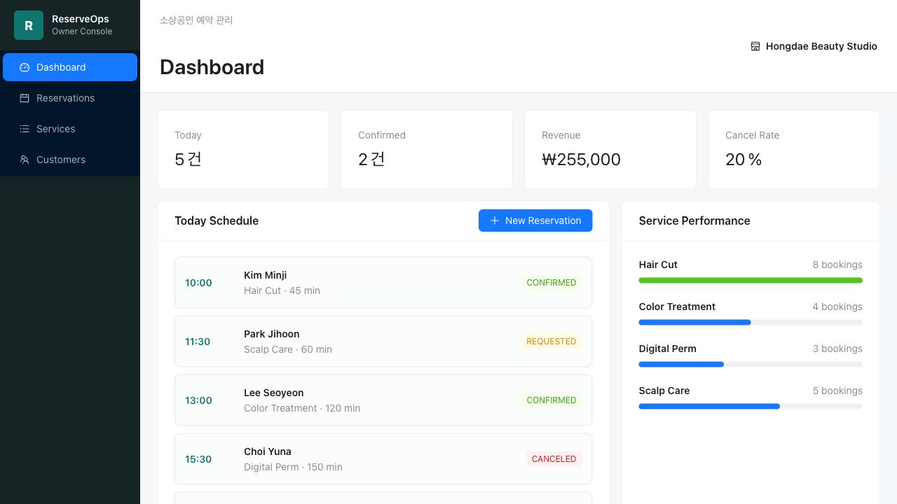

# Korean Reservation Admin

韩国本地小型门店 예약/고객/서비스 관리 项目。项目以美容室、护理店、预约制门店为业务背景，模拟店主或前台员工在后台中查看当天预约、处理预约状态、管理服务项目和查看顾客资料的工作流。

这个项目的目标不是做静态展示页，而是用 React + TypeScript 做一个接近真实业务后台的前端作品：页面文案以韩文为主，代码中保留中文注释，方便学习时理解每个模块的职责。

## Tech Stack

- React 19
- TypeScript
- Vite
- Ant Design
- React Hooks
- CSS Grid / Flex layout
- REST API adapter with mock fallback
- Java 21
- Spring Boot 3
- Maven

## Features

- Dashboard
  - 今日预约数量
  - 确定预约数量
  - 预计销售额
  - 取消率
  - 运营中服务数量
  - 今日预约时间线
  - 服务별 예약 현황

- Reservations
  - 预约列表
  - 按状态筛选
  - 按日期筛选
  - 按顾客姓名或手机号搜索
  - 新增预约
  - 查看预约详情
  - 预约状态流转：요청 -> 확정 -> 완료
  - 取消预约

- Services
  - 服务项目列表
  - 新增服务
  - 服务 활성 / 비활성 切换
  - 服务价格、时长、预约次数展示

- Customers
  - 顾客列表
  - 顾客姓名 / 手机号搜索
  - 最近访问日期和访问次数展示

## Screenshot



## Project Structure

```text
src/
  api/                 # API 适配层，优先连接 Spring Boot，后端不可用时回退 mock 数据
  components/          # 可复用 UI 组件
  data/                # mock 数据
  hooks/               # 业务状态和页面逻辑
  pages/               # 页面级组件
  utils/               # 格式化和状态流转工具
  App.tsx              # 应用入口容器
  types.ts             # 全局业务类型
backend/
  src/main/java/       # Spring Boot REST API
  pom.xml              # Maven 配置
```

## Local Setup

前端可以单独运行；如果后端没有启动，`src/api/reservationApi.ts` 会自动回退到 mock 数据。

```bash
npm install
npm run dev
```

默认开发地址：

```text
http://127.0.0.1:5173/
```

构建检查：

```bash
npm run build
```

## Full Stack Setup

推荐先启动后端，再启动前端：

```bash
cd backend
mvn -Dmaven.repo.local=.m2 spring-boot:run
```

另开一个终端：

```bash
npm run dev
```

前端会优先请求：

```text
http://127.0.0.1:8080/api
```

如果后端未启动，前端会自动使用本地 mock fallback，方便演示和开发。

## Backend

当前后端位于 `backend/`，第一阶段使用内存数据，接口结构先和前端 API contract 对齐。

启动后端：

```bash
cd backend
mvn -Dmaven.repo.local=.m2 spring-boot:run
```

默认后端地址：

```text
http://127.0.0.1:8080
```

后端编译检查：

```bash
cd backend
mvn -Dmaven.repo.local=.m2 test
```

已实现接口：

```text
GET    /api/workspace
GET    /api/reservations
POST   /api/reservations
PATCH  /api/reservations/{id}
PATCH  /api/reservations/{id}/status

GET    /api/services
POST   /api/services
PATCH  /api/services/{id}
PATCH  /api/services/{id}/status

GET    /api/customers
```

## Backend Plan

当前 `src/api/reservationApi.ts` 已经接入 Spring Boot REST API，并保留 mock fallback。

接口草案见 [docs/api-contract.md](docs/api-contract.md)。

推荐后续后端技术：

- PostgreSQL
- Spring Data JPA
- JWT 或 Session 登录

后续可以继续补充：

- 登录和权限控制
- 分页
- 数据库存储
- 单元测试和接口测试

## Commit Guide

推荐按模块拆分提交，避免只有一次大提交：

```text
feat: initialize vite react reservation admin
feat: build reservation dashboard and layout
feat: add reservation management flow
feat: add service and customer management pages
refactor: split pages components hooks and api adapter
docs: add project readme and screenshot
```
